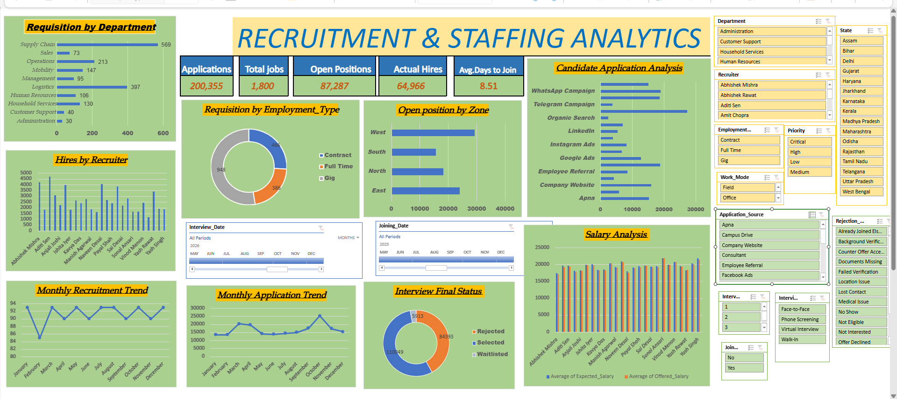

# Recruitment & Staffing Analysis Dashboard

## Project Overview

This project is an interactive Recruitment & Staffing Analysis Dashboard developed using Microsoft Excel.

The dashboard provides insights into job requisitions, candidate applications, interviews, hiring, recruitment trends, salary analysis, and rejection reasons.

## Tools Used

- Microsoft Excel
- PivotTables
- PivotCharts
- Slicers
- Timelines
- Excel formulas
- Data cleaning and transformation

## Dataset

The project uses recruitment and staffing data containing information about:

- Job requisitions
- Departments
- Employment types
- Locations and zones
- Candidates
- Applications
- Interviews
- Recruiters
- Salaries
- Offers
- Joining status
- Rejection reasons

## Key KPIs

- Total Applications
- Total Jobs
- Open Positions
- Actual Hires
- Average Days to Join

## Dashboard Features

### Recruitment Analysis
- Requisition by Department
- Requisition by Employment Type
- Open Positions by Zone
- Hires by Recruiter

### Candidate Analysis
- Candidate Applications by Source
- Monthly Application Trend
- Interview Final Status
- Rejection Analysis

### Additional Analysis
- Monthly Recruitment Trend
- Salary Analysis
- Interview and Joining Date timelines

## Interactivity

The dashboard includes interactive slicers and timelines that allow users to filter and explore recruitment data dynamically.

Users can analyze the dashboard by different recruitment and candidate attributes such as department, recruiter, employment type, priority, work mode, application source, interview status, and dates.

## Key Insights

The dashboard can be used to identify:

- Recruitment volume across departments
- Hiring performance by recruiter
- Application trends over time
- Distribution of open positions across zones
- Candidate application sources
- Interview outcomes
- Rejection reasons
- Expected vs offered salary patterns
- Average time taken for candidates to join

## Project Objective

The objective of this project is to transform recruitment data into an interactive dashboard that can support recruitment performance analysis and data-driven decision making.

## Dashboard Preview

